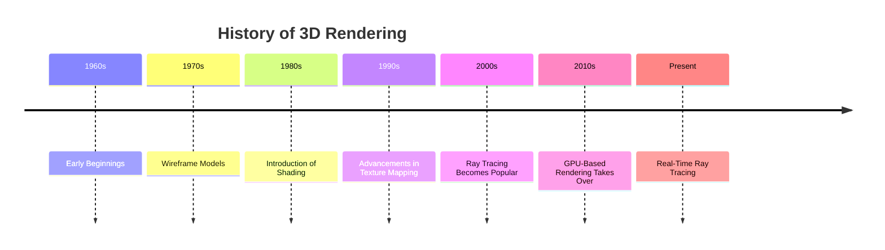

Modern CPUs have specialized functions to support the Operating systems
## Privilege levels
### Software
- Applications don't have direct access to hardware
- Only the OS can execute I/O and address commands
### Hardware
- Each ISA instruction is mapped to a specific level
- at each given time a CPU is at a specific level
- instructions can be executed iff level is equal or higer to the required level
### Example
in the arm architecture
- has 2 privilege level
	- `EL0`
	- `EL1`
- applications operate on `EL0`
- OS operates at `EL1`
## Software Interrupts
### system call 
is similar to a subroutine but while subroutines can't jump privilege level, we use an `software inerrupt` programs need to ask the `OS` to perform tasks for the program.
### traps
traps are seedcases where an error occurred e.g. wrong privilege level, divided by zero etc. 
### memory handling
- handles `memory isolation`
	- application can't read memory of other applications
- can mark parts of memory as `readonly`
### Segmentations
The memory of a computer is divided in segments. 
### Pagination
memory is divided in pages of same length.
#### Page table
`page tables` is filled by the OS and that gives a `virtual address` to every page and the programm witch is currently using this page.
## GPUs
In charge to "drawing" the contents displayed on screen
- has a physical bus (DP, HDMI) 
- The CPU with help of the GPU draws the content filling the `frame buffer`
### in 2D
can be done directly by the CPU
### in 3D
- to heavy for CPU
- CPU offloads those computations to the GPU
### architecture
specifically designed to `do 3D graphics`
- real time rendering is between the most difficult tasks

### Computer Representation of 3d Objects
- objects are stored as coordinates
- coordinates form triangles
- triangles form surfaces
the collection of coordinates are called a `mesh`
`3D renderings` are one of the main use-cases of `linear algebra`
### Rasterizations
when the geometry is ready it is rasterized, e.g. `transformed into a 2d image`
the `mashes` are mapped to `textures` in ordered to give 3D objects `color`

to render the final image a light source is added and the new shade of color (including shadows or reflections) are calculated and finally displayed.
### programmable shades
with advancements in gpus and algorithms more advanced shades where possible
![[Pasted image 20240110092008.png]]
also post processing is widely common nowadays e.g. motion blur 
#### old gpus
A lot of things cannot be implemented
with only the fixed pipeline:
• Shades
• Reflections
• Particle effects
(fog, explosions, fire, etc…)
• Post-processing effects
(e.g. motion blur)
#### new gpus
Modern GPUs are instead programmable:
- Instead of executing a fixed sequence of steps, the GPU executes a custom program (made of ad-hoc hardware instructions) that
- manipulates the geometry and the textures to render the final image. Such programs are called shaders and are loaded by the CPU onto the GPU together with draw calls
gpus are optimized chips to execute very simple operations at high speed and in parallels.

### Gneral purpuse GPU computing
possible fields:
- scientific coputations
	- physics sims
	- weather forecasting
	- biology
- machine learning 
- ...
**in recent time GPUs became capable of executing general purpose programs**
