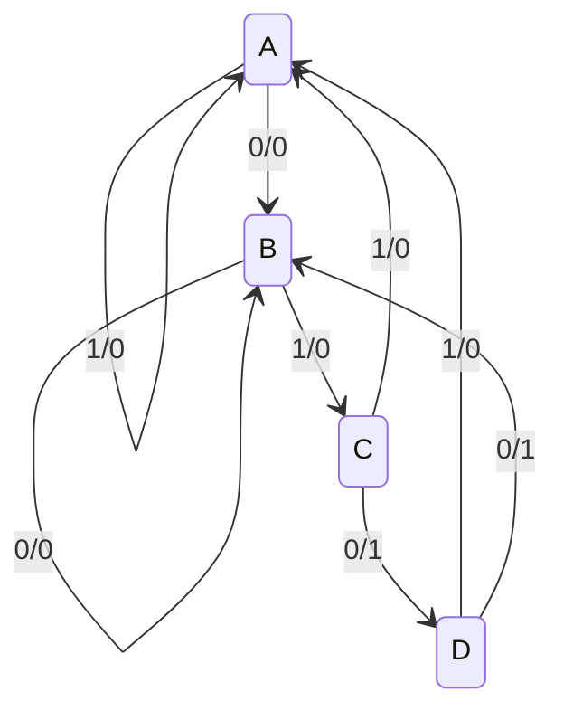
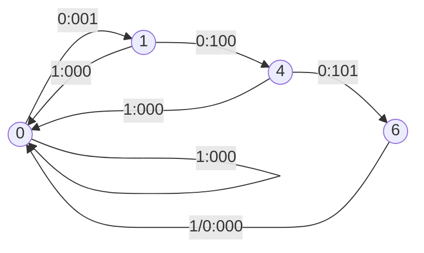

## Flip flop (Set-Reset)
Flip Flops are used to store memory
![[Pasted image 20231122080955.png]]
### D flip-flop
![[Pasted image 20231122081251.png]]
## Edge triggered clock
The clock is enabled only when the clock changes steep
![[Pasted image 20231122081556.png]]
## An array of flip-flops can be used to store infomation
![[Pasted image 20231122082550.png]]
### Shift registers
![[Pasted image 20231122083423.png]]
## State machines
Sequential circuits are often implemented as `state machines`
- the output depends on the current state and the current input
- each cycle the circuits comp

