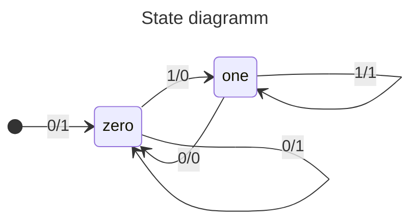

#### Mehtods of Proof

`Existential statement Proof:` in form $∃d ∈ D$, such that $Q(d)$. 
- Find whatness such that $Q(d)$ is True
- Showing $Q(d)$ is true  guaranteed by an axiom or a previously proved theorem
`Disprooving Universal statements:` find counterexample
`Prooving Universal statements:` in form $∀d ∈ D$, if $P(d)$ then $Q(d)$
- `exaustion` if $D$ is finite or a finite numbers of elements satisfy $P(d)$ 
- 

the circuit gives O = 1 if the last two imputs are eather all 1 or all 0

```
I:  
O:  
```



2^4 = 16

11