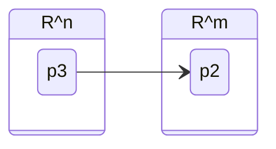

## a function for vectors

$f: \mathbb{R}^n \rightarrow \mathbb{R}^m$

Example:

$$
\begin{align}
	f(\begin{bmatrix}
           x_{1} \\
           x_{2} \\
           x_{3}
         \end{bmatrix}) = 
         \begin{bmatrix}
           x_{1} +2x_2\\
           3x_{3} \\
         \end{bmatrix}
\end{align}
$$
$f: \mathbb{R}^3\rightarrow\mathbb{R}^2$