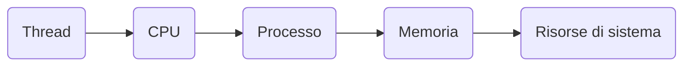

## Riassunto e Appunti

**Thread e Concorrenza**

Un thread è l'unità base d'uso della CPU e comprende identificatore, contatore di programma, registri, stack e condivide con gli altri thread la sezione di codice, la sezione dati e le risorse di sistema.

Un processo tradizionale è chiamato processo pesante (heavyweight process) ed è composto da un solo thread. Un processo multithread svolge più compiti parallelamente.

**Motivazioni per l'utilizzo del Multithreading**

* Migliore tempo di risposta
* Condivisione delle risorse
* Economia
* Scalabilità

**Multithreading e Multicore**

Il multithreading è stato sviluppato per sfruttare al meglio i sistemi multicore.

**Sfide nella Programmazione Multithread**

* Identificare i task
* Bilanciamento
* Suddivisione dei dati
* Dipendenze dei dati
* Test e debugging

**Modelli Multithreading**

* Modello da molti a uno
* Modello da uno a uno
* Modello da molti a molti

**Librerie dei Thread**

* POSIX Pthreads
* Windows
* Java

**Threading Sincrono/Asincrono**

* Sincrono
* Asincrono

**Esempio di Threading con Pthreads**

```c
#include <pthread.h>
#include <stdio.h>

#include <stdlib.h>

int sum; /* this data is shared by the thread(s) */
void *runner(void *param); /* threads call this function */

int main(int argc, char *argv[])
{
  pthread_t tid; /* the thread identifier */
  pthread_attr_t attr; /* set of thread attributes */

  /* set the default attributes of the thread */
  pthread_attr_init(&attr);
  /* create the thread */
  pthread_create(&tid, &attr, runner, argv[1]);
  /* wait for the thread to exit */
  pthread_join(tid,NULL);

  printf("sum = %d∖n",sum);
}

/* The thread will execute in this function */
void *runner(void *param)
{
  int i, upper = atoi(param);
  sum = 0;

  for (i = 1; i <= upper; i++)
    sum += i;

  pthread_exit(0);
}
```

**Threading Implicito**

Il threading implicito sposta la logica di threading e parallelismo dal lato sviluppatore a quello del compilatore e delle librerie run-time.

**Gruppi di Thread (Thread Pool)**

Un thread pool è una struttura dati che contiene un numero fisso di thread. I task vengono sottomessi alla thread pool e un thread disponibile viene "svegliato" e assegnato all'esecuzione del task.

**Fork Join**

Con questa strategia un processo genitore genera vari processi figli, attende la terminazione della loro esecuzione e poi combina i risultati parziali per ottenere il risultato finale.

**OpenMP**

OpenMP è un'API in C/C++ per programmazione parallela in ambienti a memoria condivisa.

**Problemi di Programmazione Multithreading**

* fork() e exec()
* Gestione dei segnali
* Cancellazione dei thread
* Dati locali dei thread
* Attivazione dello scheduler

**Diagramma con Mermaid**


