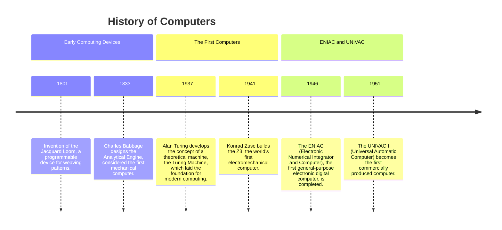
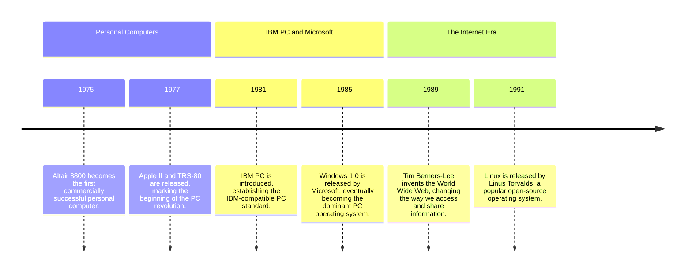
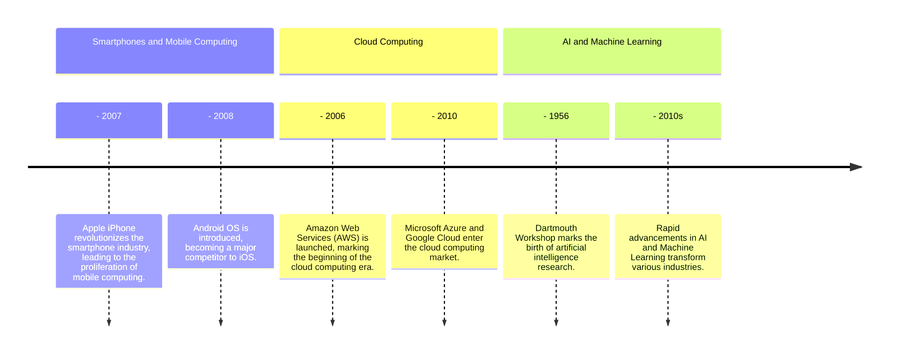

```mermaid
timeline
    title History of Computers
    section Early Computing Devices
        - 1801: Invention of the Jacquard Loom, a programmable device for weaving patterns.
        - 1833: Charles Babbage designs the Analytical Engine, considered the first mechanical computer.

    section The First Computers
        - 1937: Alan Turing develops the concept of a theoretical machine, the Turing Machine, which laid the foundation for modern computing.
        - 1941: Konrad Zuse builds the Z3, the world's first electromechanical computer.

    section ENIAC and UNIVAC
        - 1946: The ENIAC (Electronic Numerical Integrator and Computer), the first general-purpose electronic digital computer, is completed.
        - 1951: The UNIVAC I (Universal Automatic Computer) becomes the first commercially produced computer.
```

```mermaid
timeline
    section Personal Computers
        - 1975: Altair 8800 becomes the first commercially successful personal computer.
        - 1977: Apple II and TRS-80 are released, marking the beginning of the PC revolution.

    section IBM PC and Microsoft
        - 1981: IBM PC is introduced, establishing the IBM-compatible PC standard.
        - 1985: Windows 1.0 is released by Microsoft, eventually becoming the dominant PC operating system.
    section The Internet Era
        - 1989: Tim Berners-Lee invents the World Wide Web, changing the way we access and share information.
        - 1991: Linux is released by Linus Torvalds, a popular open-source operating system.
```

```mermaid
timeline

    section Smartphones and Mobile Computing
        - 2007: Apple iPhone revolutionizes the smartphone industry, leading to the proliferation of mobile computing.
        - 2008: Android OS is introduced, becoming a major competitor to iOS.

    section Cloud Computing
        - 2006: Amazon Web Services (AWS) is launched, marking the beginning of the cloud computing era.
        - 2010: Microsoft Azure and Google Cloud enter the cloud computing market.

    section AI and Machine Learning
        - 1956: Dartmouth Workshop marks the birth of artificial intelligence research.
        - 2010s: Rapid advancements in AI and Machine Learning transform various industries.
```
